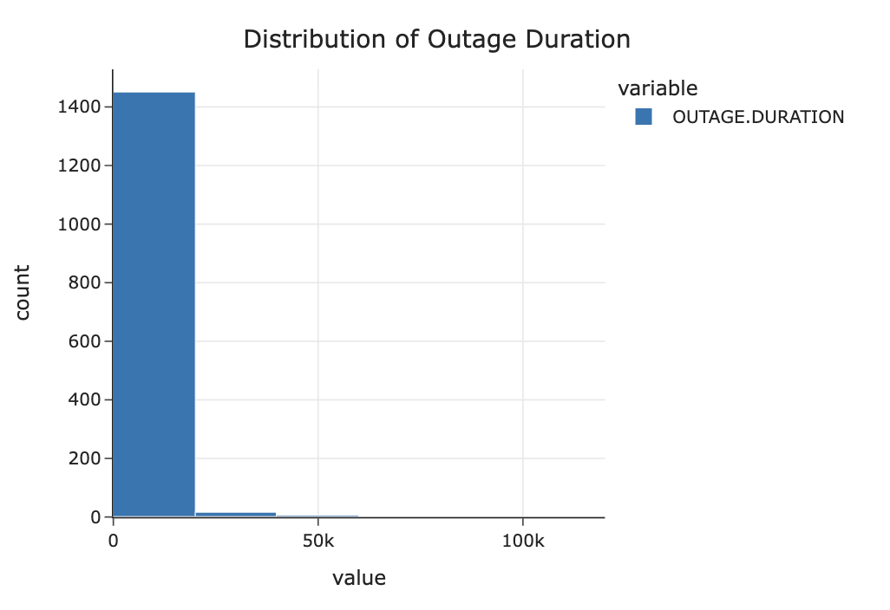
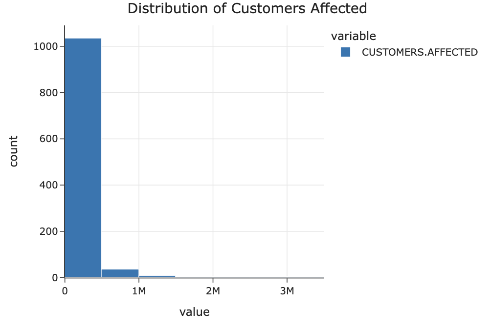
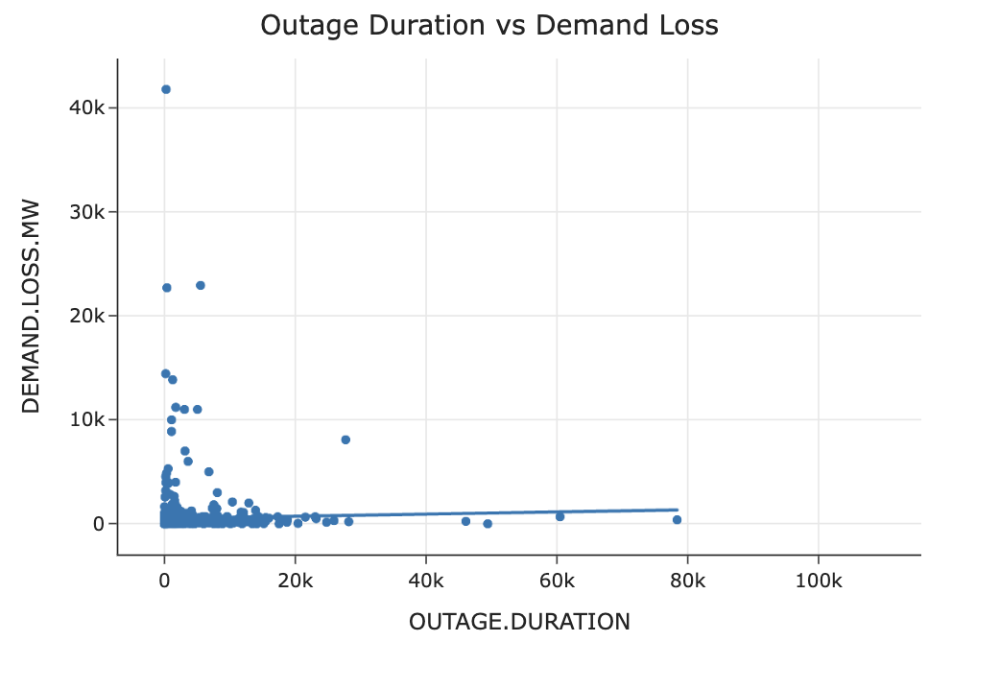
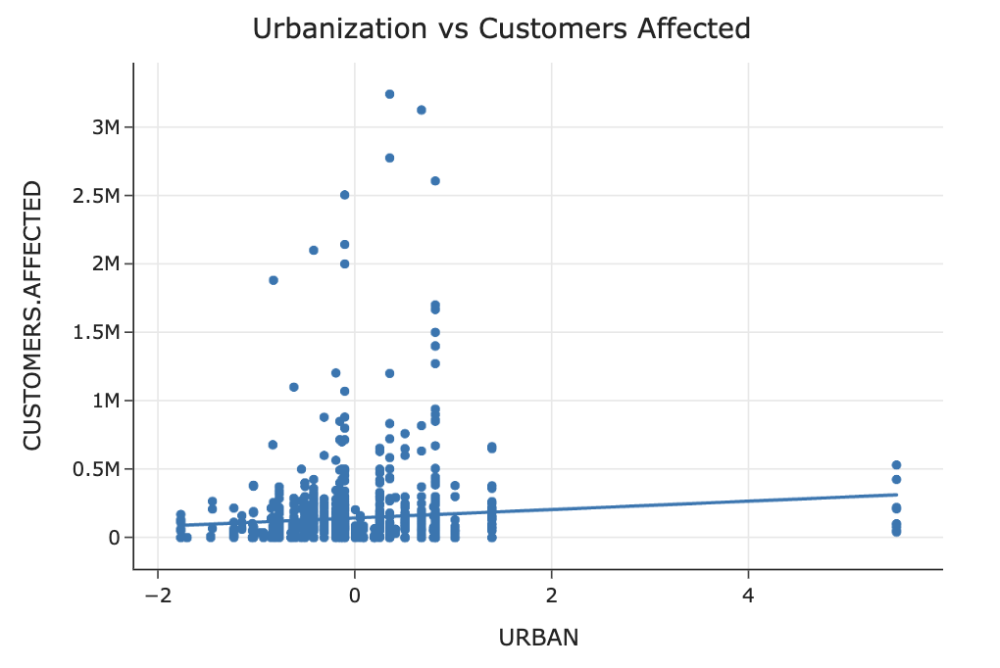
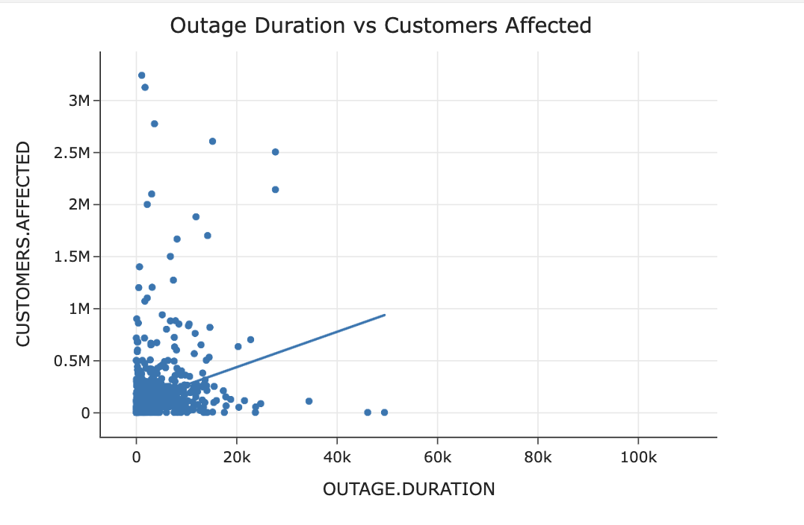
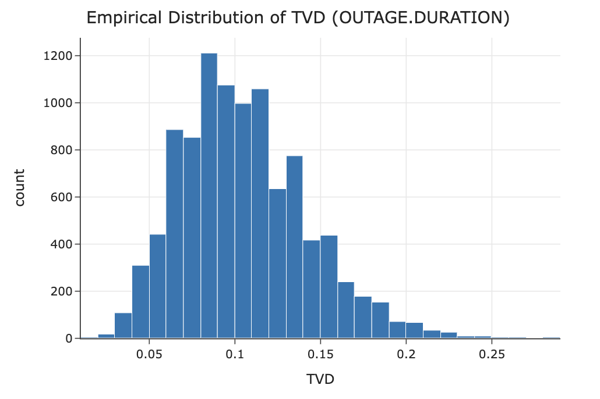
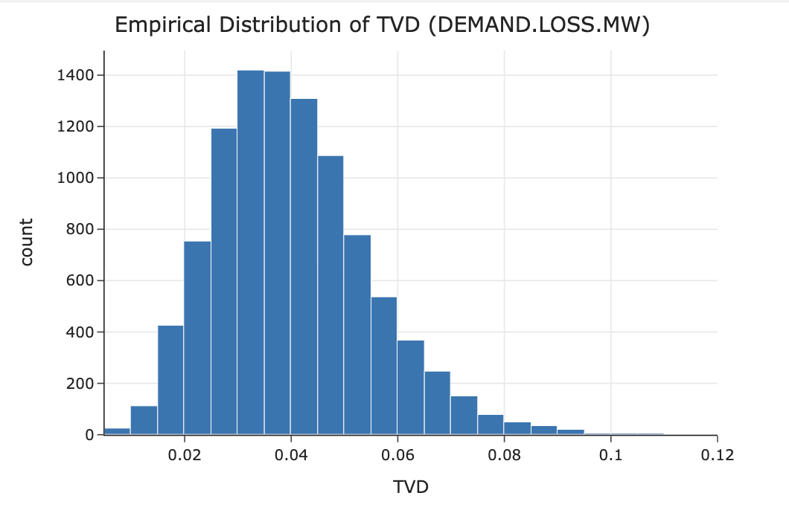
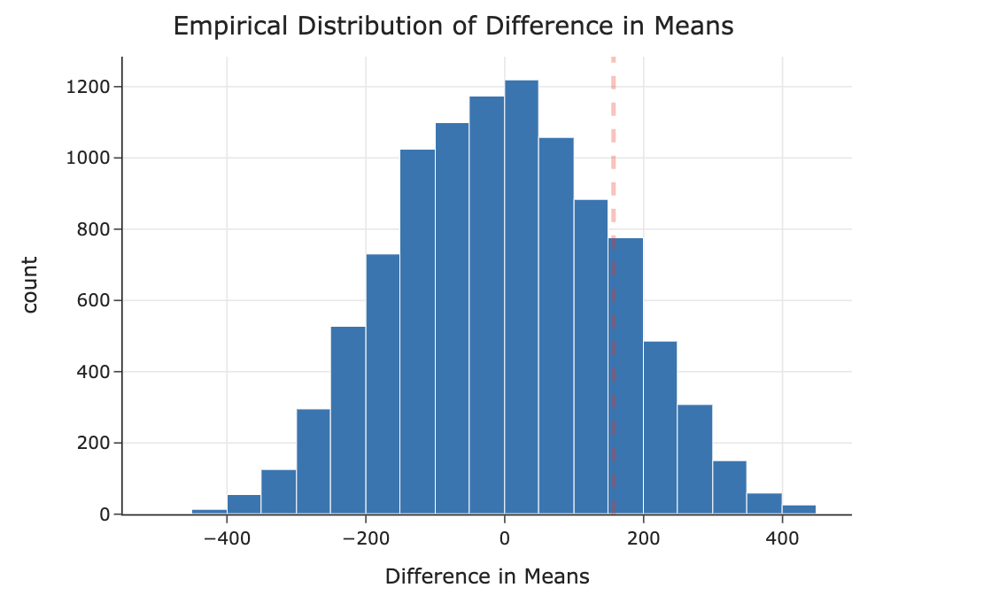

# Power Outage Analysis
# Introduction
Power outages are a an issue of critical infrastucture failure in the United States. Power outages affect millions of people each year and disrupt daily life, business and safety. Outages are caused by a variety of factors including weather, equipment failure and human interference. By understanding common patterns behind outages and their impact, we can improve power grid stability and improve response strategies.

This project analyzes a dataset of major power outages in the U.S. from 2000 to 2016, created by Purdue University's Labratory for Advancing Sustainable Critical Infrastructure. The outages in this dataset are typically defined as events affecting at least 50,000 customers or of significant demand loss.

The central question of this analysis is: **Do outages caused by severe weather lead to greater demand loss compared to outages caused by other facotrs?**

This question focuses on different outage causes with demand loss as our measure of severity. Answering this question gives insight into how specific events result in more distruptive outages, giving us possible recommendations for infrastructure planning and risk mitigation in the future to build stronger systems for our communities.

The original dataset has 1534 rows (outages) and 57 columns (features). In this analysis, I'll focus on some selected most relevant columns listed below.

| Column | Description |
|--------|-------------|
| `YEAR` | Year an outage occurred |
| `MONTH` | Month an outage occurred |
| `U.S._STATE` | State the outage occurred in |
| `NERC.REGION` | North American Electric Reliability Corporation (NERC) region of the outage |
| `CLIMATE.REGION` | U.S. climate region (NCEI classification) |
| `ANOMALY.LEVEL` | Oceanic Niño Index (ONI) indicating El Niño/La Niña intensity |
| `CLIMATE.CATEGORY` | Climate condition category (e.g., normal, El Niño, La Niña) |
| `OUTAGE.START.DATE` | Date when the outage started |
| `OUTAGE.START.TIME` | Time when the outage started |
| `OUTAGE.RESTORATION.DATE` | Date when the restoration started |
| `OUTAGE.RESTORATION.TIME` | Time when the restoration started |
| `CAUSE.CATEGORY` | Main cause of the outage |
| `OUTAGE.DURATION` | Duration of the outage (minutes) |
| `DEMAND.LOSS.MW` | Peak demand loss during the outage (MW) |
| `CUSTOMERS.AFFECTED` | Number of customers affected |
| `TOTAL.PRICE` | Average electricity price in the state (cents/kWh) |
| `TOTAL.SALES` | Total electricity consumption in the state (MWh) |
| `TOTAL.CUSTOMERS` | Total number of electricity customers in the state |
| `POPPCT_URBAN` | Percentage of population living in urban areas |
| `POPDEN_URBAN` | Urban population density (persons per square mile) |
| `AREAPCT_URBAN` | Percentage of land area classified as urban |

# Data Cleaning and Explanatory Data Analysis
I started by cleaning the data to prepare it for analysis.

### Data Cleaning
I began by only keeping relevant columns for the analysis. This removes unrelated features and ensures the columns in my dataset aligned with the scope of the project.For this analysis, I'll be using the columns I included in the data dictionary above. 

Next, I combined the OUTAGE.START.DATE and OUTAGE.START.TIME columns into one Timestamp object in an OUTAGE.START column. I did the same for OUTAGE.RESTORATION.DATE and OUTAGE.RESTORATION.TIME to create a Timestamp object called OUTAGE.RESTORATION. After this, I dropped the old columns I used to make these two new columns.

Next, I checked my outcome variables, OUTAGE.DURATION, CUSTOMERS.AFFECTED, and DEMAND.LOSS.MW for values of 0. Values of 0 are likely evidence of missing values or improperly recorded data since major outages wouldn’t have a duration of 0 minutes, 0 customers affected, or 0 MW of energy lost. Before modifying them, I displayed how often zeros and missing values occur to better understand the structure of missingness.

I also evaluated missingness across all columns and found that DEMAND.LOSS.MW and CUSTOMERS.AFFECTED have substantial missing values, while OUTAGE.DURATION and the timestamp variables have a smaller number of missing values. This confirms that missingness should be analyzed later in the analysis.

To simplify urbanization-related information, I combined POPPCT_URBAN, POPDEN_URBAN, and AREAPCT_URBAN into one column, URBAN. Because these variables are on different scales, I started by standardizing each one and then averaging them. This produces a measure of urbanization that avoids any single variable dominating the new feature. After creating this feature, I dropped the original urbanization columns to reduce redundancy.

Finally, I corrected data types across the dataset. Numeric variables stored as objects were converted to numeric types. Similarly, categorical variables were converted to be strings and YEAR and MONTH were converted to integers. This ensures that any computation done later in the analysis can happen smoothly.

Below is the first 5 rows of this cleaned dataset.

    <table border="1" class="dataframe">
  <thead>
    <tr style="text-align: right;">
      <th>YEAR</th>
      <th>MONTH</th>
      <th>U.S._STATE</th>
      <th>NERC.REGION</th>
      <th>CLIMATE.REGION</th>
      <th>ANOMALY.LEVEL</th>
      <th>CLIMATE.CATEGORY</th>
      <th>CAUSE.CATEGORY</th>
      <th>OUTAGE.DURATION</th>
      <th>DEMAND.LOSS.MW</th>
      <th>CUSTOMERS.AFFECTED</th>
      <th>TOTAL.PRICE</th>
      <th>TOTAL.SALES</th>
      <th>TOTAL.CUSTOMERS</th>
      <th>OUTAGE.START</th>
      <th>OUTAGE.RESTORATION</th>
      <th>URBAN</th>
    </tr>
  </thead>
  <tbody>
    <tr>
      <td>2011</td>
      <td>7</td>
      <td>Minnesota</td>
      <td>MRO</td>
      <td>East North Central</td>
      <td>-0.3</td>
      <td>normal</td>
      <td>severe weather</td>
      <td>3060.0</td>
      <td>NaN</td>
      <td>70000.0</td>
      <td>9.28</td>
      <td>6.56e+06</td>
      <td>2.60e+06</td>
      <td>2011-07-01 17:00:00</td>
      <td>2011-07-03 20:00:00</td>
      <td>-0.51</td>
    </tr>
    <tr>
      <td>2014</td>
      <td>5</td>
      <td>Minnesota</td>
      <td>MRO</td>
      <td>East North Central</td>
      <td>-0.1</td>
      <td>normal</td>
      <td>intentional attack</td>
      <td>1.0</td>
      <td>NaN</td>
      <td>NaN</td>
      <td>9.28</td>
      <td>5.28e+06</td>
      <td>2.64e+06</td>
      <td>2014-05-11 18:38:00</td>
      <td>2014-05-11 18:39:00</td>
      <td>-0.51</td>
    </tr>
    <tr>
      <td>2010</td>
      <td>10</td>
      <td>Minnesota</td>
      <td>MRO</td>
      <td>East North Central</td>
      <td>-1.5</td>
      <td>cold</td>
      <td>severe weather</td>
      <td>3000.0</td>
      <td>NaN</td>
      <td>70000.0</td>
      <td>8.15</td>
      <td>5.22e+06</td>
      <td>2.59e+06</td>
      <td>2010-10-26 20:00:00</td>
      <td>2010-10-28 22:00:00</td>
      <td>-0.51</td>
    </tr>
    <tr>
      <td>2012</td>
      <td>6</td>
      <td>Minnesota</td>
      <td>MRO</td>
      <td>East North Central</td>
      <td>-0.1</td>
      <td>normal</td>
      <td>severe weather</td>
      <td>2550.0</td>
      <td>NaN</td>
      <td>68200.0</td>
      <td>9.19</td>
      <td>5.79e+06</td>
      <td>2.61e+06</td>
      <td>2012-06-19 04:30:00</td>
      <td>2012-06-20 23:00:00</td>
      <td>-0.51</td>
    </tr>
    <tr>
      <td>2015</td>
      <td>7</td>
      <td>Minnesota</td>
      <td>MRO</td>
      <td>East North Central</td>
      <td>1.2</td>
      <td>warm</td>
      <td>severe weather</td>
      <td>1740.0</td>
      <td>250.0</td>
      <td>250000.0</td>
      <td>10.43</td>
      <td>5.97e+06</td>
      <td>2.67e+06</td>
      <td>2015-07-18 02:00:00</td>
      <td>2015-07-19 07:00:00</td>
      <td>-0.51</td>
    </tr>
  </tbody>
</table>

### Explanatory Data Analysis
#### Univariate Analysis
I started by exploratory data analysis with univariate analysis to visualize the distribution of single variables.

First, I examined the distribution of outage duration. This allowed me to visualize how outage lengths vary across events and whether the distribution is concentrated among shorter outages more extreme durations.

Then, I looked at the distribution of customers affected. This allowed me to see the scale of the outages and show whether most events impact a few customers or if a small number of large-scale outages dominate the dataset.

#### Bivariate Analysis
Next, I examined the relationships between 2 variables to see if patterns emerged when visualized.

I began by examining the relationship between Outage Duration and Demand Loss. I expected to see a positive association because the longer an outage lasts, the more demand is lost over time. 

Next, I visualized the relationship between urbanization and customers affected. I expected to see a positive association because outages in more urbanized areas are likely to impact a larger number of customers due to higher population density. This helps assess whether urbanization is a predictor of outage scale.

Lastly, I plotted outage duration against customers affected to see if longer outages impact more people. This helps determine whether outage severity is driven primarily by duration, scale or both.

#### Grouping and Aggregation 
I grouped the dataset by NERC Region to see the distribution of outages by region. This provides a way to see which regions experience more severe outages.

<table border="1" class="dataframe">
  <thead>
    <tr style="text-align: right;">
      <th></th>
      <th>num_outages</th>
      <th>avg_duration</th>
      <th>avg_customers_affected</th>
      <th>avg_demand_loss</th>
    </tr>
    <tr>
      <th>NERC.REGION</th>
      <th></th>
      <th></th>
      <th></th>
      <th></th>
    </tr>
  </thead>
  <tbody>
    <tr>
      <th>WECC</th>
      <td>451</td>
      <td>1481.49</td>
      <td>133833.07</td>
      <td>498.24</td>
    </tr>
    <tr>
      <th>RFC</th>
      <td>419</td>
      <td>3477.96</td>
      <td>127894.23</td>
      <td>293.15</td>
    </tr>
    <tr>
      <th>SERC</th>
      <td>205</td>
      <td>1737.99</td>
      <td>107854.04</td>
      <td>556.33</td>
    </tr>
    <tr>
      <th>NPCC</th>
      <td>150</td>
      <td>3262.17</td>
      <td>108726.04</td>
      <td>930.12</td>
    </tr>
    <tr>
      <th>TRE</th>
      <td>111</td>
      <td>2960.57</td>
      <td>226468.65</td>
      <td>635.62</td>
    </tr>
    <tr>
      <th>SPP</th>
      <td>67</td>
      <td>2693.77</td>
      <td>188513.00</td>
      <td>159.00</td>
    </tr>
    <tr>
      <th>MRO</th>
      <td>46</td>
      <td>2933.59</td>
      <td>88984.97</td>
      <td>279.50</td>
    </tr>
    <tr>
      <th>FRCC</th>
      <td>44</td>
      <td>4271.12</td>
      <td>289778.18</td>
      <td>804.45</td>
    </tr>
    <tr>
      <th>ECAR</th>
      <td>34</td>
      <td>5603.31</td>
      <td>256354.19</td>
      <td>1314.48</td>
    </tr>
    <tr>
      <th>HECO</th>
      <td>3</td>
      <td>895.33</td>
      <td>126728.67</td>
      <td>466.67</td>
    </tr>
    <tr>
      <th>ASCC</th>
      <td>1</td>
      <td>NaN</td>
      <td>14273.00</td>
      <td>35.00</td>
    </tr>
    <tr>
      <th>FRCC, SERC</th>
      <td>1</td>
      <td>372.00</td>
      <td>NaN</td>
      <td>NaN</td>
    </tr>
    <tr>
      <th>HI</th>
      <td>1</td>
      <td>1367.00</td>
      <td>294000.00</td>
      <td>1060.00</td>
    </tr>
    <tr>
      <th>PR</th>
      <td>1</td>
      <td>174.00</td>
      <td>62000.00</td>
      <td>220.00</td>
    </tr>
  </tbody>
</table>

Then, I group by cause category to see how different types of outage causes vary in frequency and impact. This helps us identify whether certain causes are associated with specific type of outages.

<table border="1" class="dataframe">
  <thead>
    <tr style="text-align: right;">
      <th></th>
      <th>num_outages</th>
      <th>avg_duration</th>
      <th>avg_customers_affected</th>
      <th>avg_demand_loss</th>
    </tr>
    <tr>
      <th>CAUSE.CATEGORY</th>
      <th></th>
      <th></th>
      <th></th>
      <th></th>
    </tr>
  </thead>
  <tbody>
    <tr>
      <th>severe weather</th>
      <td>763</td>
      <td>3883.99</td>
      <td>188574.80</td>
      <td>618.66</td>
    </tr>
    <tr>
      <th>intentional attack</th>
      <td>418</td>
      <td>429.98</td>
      <td>1790.53</td>
      <td>9.15</td>
    </tr>
    <tr>
      <th>system operability disruption</th>
      <td>127</td>
      <td>728.87</td>
      <td>211066.02</td>
      <td>928.90</td>
    </tr>
    <tr>
      <th>public appeal</th>
      <td>69</td>
      <td>1468.45</td>
      <td>7618.76</td>
      <td>1784.93</td>
    </tr>
    <tr>
      <th>equipment failure</th>
      <td>60</td>
      <td>1816.91</td>
      <td>101935.57</td>
      <td>372.40</td>
    </tr>
    <tr>
      <th>fuel supply emergency</th>
      <td>51</td>
      <td>13484.03</td>
      <td>0.14</td>
      <td>540.22</td>
    </tr>
    <tr>
      <th>islanding</th>
      <td>46</td>
      <td>200.55</td>
      <td>6169.09</td>
      <td>396.56</td>
    </tr>
  </tbody>
</table>

Finally, I used a pivot table to summarize average outage duration and demand loss across regions and cause. This allows for a simple comparison of how outage characteristics differ across key dimensions.

<table border="1" class="dataframe">
  <thead>
    <tr style="text-align: right;">
      <th>CAUSE.CATEGORY</th>
      <th>equipment failure</th>
      <th>fuel supply emergency</th>
      <th>intentional attack</th>
      <th>islanding</th>
      <th>public appeal</th>
      <th>severe weather</th>
      <th>system operability disruption</th>
    </tr>
    <tr>
      <th>NERC.REGION</th>
      <th></th>
      <th></th>
      <th></th>
      <th></th>
      <th></th>
      <th></th>
      <th></th>
    </tr>
  </thead>
  <tbody>
    <tr>
      <th>ECAR</th>
      <td>NaN</td>
      <td>NaN</td>
      <td>1440.00</td>
      <td>NaN</td>
      <td>NaN</td>
      <td>6035.14</td>
      <td>2960.67</td>
    </tr>
    <tr>
      <th>FRCC</th>
      <td>554.50</td>
      <td>NaN</td>
      <td>50.00</td>
      <td>NaN</td>
      <td>4320.00</td>
      <td>6420.19</td>
      <td>181.88</td>
    </tr>
    <tr>
      <th>FRCC, SERC</th>
      <td>NaN</td>
      <td>NaN</td>
      <td>NaN</td>
      <td>NaN</td>
      <td>NaN</td>
      <td>NaN</td>
      <td>372.00</td>
    </tr>
    <tr>
      <th>HECO</th>
      <td>NaN</td>
      <td>NaN</td>
      <td>NaN</td>
      <td>NaN</td>
      <td>NaN</td>
      <td>1224.50</td>
      <td>237.00</td>
    </tr>
    <tr>
      <th>HI</th>
      <td>NaN</td>
      <td>NaN</td>
      <td>NaN</td>
      <td>NaN</td>
      <td>NaN</td>
      <td>1367.00</td>
      <td>NaN</td>
    </tr>
    <tr>
      <th>MRO</th>
      <td>NaN</td>
      <td>9077.33</td>
      <td>2061.25</td>
      <td>97.00</td>
      <td>554.00</td>
      <td>3217.33</td>
      <td>NaN</td>
    </tr>
    <tr>
      <th>NPCC</th>
      <td>247.00</td>
      <td>14351.85</td>
      <td>158.38</td>
      <td>881.00</td>
      <td>2655.00</td>
      <td>4188.71</td>
      <td>930.00</td>
    </tr>
    <tr>
      <th>PR</th>
      <td>NaN</td>
      <td>NaN</td>
      <td>NaN</td>
      <td>NaN</td>
      <td>NaN</td>
      <td>174.00</td>
      <td>NaN</td>
    </tr>
    <tr>
      <th>RFC</th>
      <td>10005.12</td>
      <td>33118.80</td>
      <td>379.55</td>
      <td>87.20</td>
      <td>905.00</td>
      <td>4051.32</td>
      <td>2354.50</td>
    </tr>
    <tr>
      <th>SERC</th>
      <td>299.14</td>
      <td>14805.00</td>
      <td>434.46</td>
      <td>223.00</td>
      <td>1260.15</td>
      <td>2104.77</td>
      <td>479.71</td>
    </tr>
    <tr>
      <th>SPP</th>
      <td>600.00</td>
      <td>76.00</td>
      <td>252.50</td>
      <td>493.50</td>
      <td>1013.81</td>
      <td>4527.75</td>
      <td>1111.00</td>
    </tr>
    <tr>
      <th>TRE</th>
      <td>252.00</td>
      <td>13920.00</td>
      <td>265.00</td>
      <td>NaN</td>
      <td>1187.06</td>
      <td>3981.51</td>
      <td>778.12</td>
    </tr>
    <tr>
      <th>WECC</th>
      <td>450.94</td>
      <td>5595.18</td>
      <td>411.41</td>
      <td>184.94</td>
      <td>1860.33</td>
      <td>4223.98</td>
      <td>348.60</td>
    </tr>
  </tbody>
</table>

# Assessment of Missingness
#### MNAR Analysis
Several columns contain missing data in this dataset, but one column that is likely NMAR is **OUTAGE.DURATION**. The missingness could come from how outage timelines are recorded and reported across different sources. If certain outages did not have clearly documented start or restoration times then the duration couldnt be computed which could create a missing value. This missingness is tied to the unobserved value itself rather than being fully explained by other variables in the dataset.

Additional data that could help determine whether **OUTAGE.DURATION** is MAR would include more detailed reporting info like the specific reporting entity responsible for each outage. With this we could test whether missingness depends on observed variables like region, cause category, or reporting source, rather than the unobserved duration itself.

#### Missing Dependency
First, I examine the distribution of Cause Category when Outage Duration is missing vs not missing.
I found an observed TVD of 0.2520 with a p-value of 0.0012. The empirical distribution of the TVDs is shown below. Since this p-value is below the significance level of 0.05, I reject the null hypothesis for the alternative. This means the distribution of CAUSE.CATEGORY is significantly different when OUTAGE.DURATION is missing versus not missing suggesting that the missingness of OUTAGE.DURATION depends on CAUSE.CATEGORY.

Next, I examine the distribution of Cause Category when Demand Loss is missing vs not missing.
I found an observed TVD of 0.1787 with a p-value of 0.0. The empirical distribution of the TVDs is shown below. Since this p-value is far below 0.05, I reject the null hypothesis in favor of the alternative. This indicates that the distribution of CAUSE.CATEGORY is significantly different when DEMAND.LOSS.MW is missing versus not missing, suggesting that the missingness of DEMAND.LOSS.MW depends on CAUSE.CATEGORY.

# Hypothesis Testing
I will be testing whether outages caused by severe weather lead to greater demand loss on average compared to outages caused by other factors. The relevant columns are DEMAND.LOSS.MW and CAUSE.CATEGORY. I will use outages where CAUSE.CATEGORY is “severe weather” and compare them to all other categories.

**Null Hypothesis:** On average, the demand loss from severe weather outages is the same as the demand loss from outages caused by other factors.
 

**Alternate Hypothesis:** On average, the demand loss from severe weather outages is greater than the demand loss from outages caused by other factors.

**Test statistic:** Difference in means. Specifically, mean demand loss (severe weather) − mean demand loss (other causes). 

I performed a permutation test with 10,000 simulations to generate the null distribution of the test statistic.

The p-value I got was 0.1688, so with a standard significance level of 0.05, we fail to reject the null hypothesis because the results are not statistically significant. We conclude that there is not sufficient evidence to say that outages caused by severe weather lead to greater demand loss on average compared to outages caused by other factors.

This plot shows the observed difference in means compared to the distribution of differences generated under the null hypothesis.

''

# Framing a Prediction Problem
My model will predict the cause of a power outage, specifically whether it is due to severe weather or not. This is a binary classification problem.

The metric I'm using is the F1 score, since class imbalance is likely and F1 balances precision and recall.

At the time of prediction, I would have variables such as state, NERC region, climate region, anomaly level, year, month, total sales, total price, total customers, and urbanization metrics.

# Baseline Model
My model is a binary classifier using the features NERC.REGION, ANOMALY.LEVEL, YEAR, and URBAN to predict whether a major outage is caused by severe weather or another cause. This provides a simple starting point using core geographic, temporal, and environmental variables that are available at the time of prediction.

The features are: NERC.REGION (nominal), ANOMALY.LEVEL (quantitative), YEAR (ordinal), and URBAN (quantitative). NERC.REGION captures differences in infrastructure and regulation across regions, ANOMALY.LEVEL reflects unusual climate conditions that may contribute to severe weather, YEAR accounts for changes over time, and URBAN reflects population density and demand concentration.

The predicted column was encoded as 1 for severe weather and 0 for all other causes.
The performance of this model achieved an F1 score of 0.643 on the test set, providing a reasonable baseline but leaving room for improvement.

# Final Model
My final model incorporated the features: NERC.REGION, CLIMATE.REGION, ANOMALY.LEVEL, YEAR, MONTH, TOTAL.PRICE, TOTAL.SALES, TOTAL.CUSTOMERS, and URBAN. I used a DecisionTreeClassifier to allow for nonlinear relationships and interactions between features.

I added CLIMATE.REGION (nominal) because certain climates are more prone to severe weather events, MONTH (ordinal) to capture seasonality effects, TOTAL.PRICE (quantitative) and TOTAL.SALES (quantitative) to reflect economic and demand conditions, and TOTAL.CUSTOMERS (quantitative) to account for the scale of the population affected.

I used GridSearchCV to find the best hyperparameters for the DecisionTreeClassifier. These were: criterion: gini, max_depth: 7, min_samples_split: 2, min_samples_leaf: 1

I used the F1 score to evaluate performance. The final model achieved an F1 score of 0.724, which is an improvement over the baseline score of 0.643. This increase indicates that the additional features and model complexity improved the model’s ability to correctly classify severe weather outages while balancing precision and recall.

# Fairness Analysis
My groups for the fairness analysis are longer vs shorter outages, defined as outages with duration greater than 3000 minutes versus those with duration less than or equal to 3000 minutes. 

I decided to use these groups because outage duration reflects severity, and the model’s predicted cause can influence how well it performs across different levels of severity. Ensuring similar performance across these groups checks whether the model is consistent for both high-impact and lower-impact outages.

My evaluation metric will be the F1 score, since the classes are imbalanced and F1 captures both precision and recall. I compare the absolute difference in F1 scores between longer and shorter outages.

**Null Hypothesis:** The model is fair. F1 scores for longer and shorter outages are approximately equal, and any observed difference is due to random chance.

**Alternative Hypothesis:** The model is unfair. F1 score differs significantly between longer and shorter outages.

I performed a permutation test with 10000 trials. My significance level is the 0.05, and I got a p_value of BLANK so because this is below the significance level, I BLANK the null hypothesis. The model is 